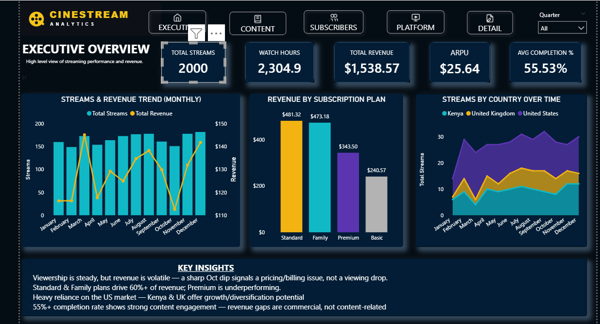

### 🎬 CineStream Analytics

**Overview:**
An end-to-end Power BI business intelligence project for **CineStream**, a fictional video-streaming platform. Raw viewing-activity, customer, movie, and platform data is modeled into a governed star schema and delivered as a fully interactive, dark-themed 6-page report — combining a 4-page executive/analytical suite with two drill-through detail pages for individual movies and customers.

**Business Problem:**
Streaming platforms generate activity at the individual watch-session level, but leadership needs answers at a much higher level: Is the platform growing, and is that growth translating into revenue? Which subscription plans, markets, and devices are actually paying off? Is content quality (completion, ratings) keeping pace with catalog investment (budget)? And when a metric moves, is it a content problem or a commercial one? 

**Process:**
- **Data modeling** — built a star schema with a central `Streaming` fact table (one row per watch event: completion %, watch duration, rating, download status) connected to four dimension tables — `Customer`, `Movie`, `Platform`, and a dedicated `Date` table — plus a disconnected `_Measures` table to keep the DAX measure library organized and separate from the data tables
- **DAX measures** — built a full measure library covering core volume/revenue metrics (Total Streams, Total Watch Hours, Total Revenue, ARPU, Active Subscribers), quality metrics (Avg Completion %, Avg User Rating, % of Streams Rated), behavioral metrics (Customer Favorite Genre, Customer Total Watch Time), and a set of `SELECTEDVALUE`-driven "Selected X" measures (Selected Director, Selected Studio, Selected Budget, Selected Runtime, Selected Age, Selected Gender, Selected Subscription Plan, etc.) that power the dynamic detail-page headers
- **Report design** — designed a custom dark theme and built 6 report pages: **Executive Overview**, **Content Performance**, **Subscriber & Engagement**, **Platform & Device**, and two drill-through pages — **Movie Detail** and **Customer Detail**
- **Navigation** — added a persistent icon-based navigation bar (action buttons) across every page plus native drill-through: clicking a title in the Content Ranking table opens Movie Detail, and clicking a name in the Viewing History table opens Customer Detail, each pre-filtered to that record
- **Geospatial & custom visuals** — used an Azure Map for stream distribution by country and imported a Table Heatmap custom visual into the report's visual library
- **Narrative layer** — wrote a "Key Insights" panel directly onto the Executive Overview page so the headline takeaways travel with the dashboard rather than living in a separate document

**Report Pages:**
- **Executive Overview** — KPI cards (Total Streams, Total Watch Hours, Total Revenue, ARPU, Avg Completion %), a monthly streams-and-revenue trend combo chart, revenue by subscription plan, streams by country over time, and a written key-insights panel
- **Content Performance** — streams by genre, completion % by genre, a Budget-vs-Completion % scatter plot (sized by revenue) to test whether spend buys engagement, and a sortable Content Performance Ranking table that drives the movie drill-through
- **Subscriber & Engagement** — Active Subscribers, Avg User Rating and % of Streams Rated KPI cards, active subscribers by plan, streams by age band, a streams-by-country map, and a plan-by-age-band completion % pivot table
- **Platform & Device** — streams by device type, streams by region & device type (100% stacked), a device-type-by-OS pivot, and downloaded-vs-streamed-live split
- **Movie Detail** *(drill-through)* — per-title KPIs (streams, revenue, completion %), metadata (director, studio, budget, runtime, IMDb rating), a viewing-history table, and audience insight callouts (top device, top country, avg watch duration, % downloaded)
- **Customer Detail** *(drill-through)* — per-customer KPIs (streams, revenue, completion %, total watch time), profile fields (plan, age, gender), a movies-watched table, and audience insight callouts (favorite device, favorite genre)

**Key Business Insights:**
- Viewership is steady, but revenue is volatile — a sharp October dip signals a pricing/billing issue rather than a drop in viewing
- Standard and Family plans drive over 60% of revenue, while the Premium plan is underperforming relative to its price point
- The platform is heavily reliant on the US market — Kenya and the UK stand out as growth and diversification opportunities
- A 55%+ completion rate across the catalog shows strong content engagement, reinforcing that revenue gaps are commercial (pricing/plan mix), not content-quality, issues

**Skills Demonstrated:**
- Star-schema data modeling (fact/dimension design, dedicated Date and Measures tables)
- DAX (aggregation measures, `DIVIDE`, `SELECTEDVALUE`, ratio/rate calculations, dynamic label measures)
- Interactive dashboard design (KPI cards, synced slicers, icon-based navigation, native drill-through)
- Geospatial visualization (Azure Maps) and custom visual integration
- Dark-theme UI/UX design for an executive-facing analytics product

**Tools:** Power BI Desktop

**Files:**
- [`CineStream_Analytics.pbix`](CineStream_Analytics.pbix) — Power BI file
- [Dashboard Screenshot.png](Cinematics-Report.png) — Preview image

